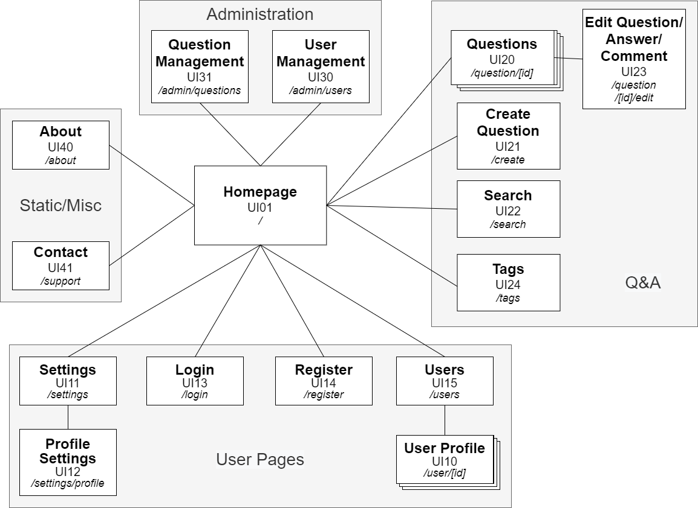

# ER: Requirements Specification Component

The iNeedHelp project intends to provide its users with a Q&A platform that helps them answer their questions in a complete, clean and easy to read way. Its users will be able to find multiple questions and answers along a variety of everyday and specific topics.

---

## A1: iNeedHelp

The iNeedHelp project is the development of a web-based information system for managing threads of questions and their respective answers, users and their information. This is a tool that can be used by anyone, but it is focused on students, teachers, investigators as well as all types of academics. A team of administrators is predefined, being them the maintainers and responsible persons for the system, ensuring it runs smoothly.

This application allows users to manage all their questions, answers as well as their personal information and awards for answering questions. A user can search a question by its title, topic or tag questions, answers, and user information will be available worldwide virtually, except the personal information of a user, which only the user and administrators will have access to. Questions are accessible to unregistered users, but to answer and post a question the user needs to be registered.

Users will be separated into groups with different permissions. These groups include the above-mentioned administrators, with complete access and modification privileges, and the registered users, with privileges to ask, answer, comment, vote and report a question, view and edit their profile and highlight their awards. By answering questions users can receive an award for their answer and the most upvoted answer will be highlighted on the question thread.

The platform will have an adaptive and responsive design, allowing users to have a clear browsing experience, regardless of the device (desktop, tablet or smartphone). The product will also provide easy navigation and a joyful overall user experience.

---

## A2: Actors and User stories

This artifact contains the specifications of the actors involved and their user stories, serving as an agile documentation for the iNeedHelp project development.

### Actors

For iNeedHelp, the actors are represented in Figure 1 and described in Table 1.

Figure 2.1 - iNeedHelp Actors

 

| Identifier  | Description  |
|---|---|
| User  |  Generic user that has access to public information, such as questions and answers, and can search topics and tags
|  Visitor |  Unauthenticated user that can register itself. Has access to public information and can perform searches
| Authenticated User  | Authenticated user that can access public information, post and answer questions, and manage their personal profile  |
|  Administrator |  Authenticated user that is responsible for the management of users, questions, answers, topics, tags and badges. Has supervisory and moderation privileges |
|  Moderator |  Authenticated user that belongs to the same location as the posted question or answer and can edit that same question or answer |
| OAuth API  |  External OAuth API that can be used to register or authenticate into the system |

Table 2.1 - iNeedHelp Actors Descriptions

## User Stories

For iNeedHelp, consider the user stories that are presented in the following sections.

### User

| Identifier  | Name  |  Priority  |  Description
|---|---|---|---|
| US01 | See Home Page | High | As a User, I want to see the home page, so that I can have an idea of what this website is about|
| US02 | See About Page | High | As a User, I want to see the about page, so that I can find out a more detailed description of this website|
| US03 | See Contact Page | High | As a User, I want to see the contact page, so that I can find solutions to issues that I may face during the usage of this website|
| US04 | Browse/Read Without Sign-in | high | As a User, I want to quickly navigate and browse the system without being forced to register or login to the system, so that I have the option to just quickly view the topic that interests me without wasting too much time|
| US05 | Search by name | high | As a User, I want to quickly search for the content that I would like to know about (posts, questions, users) by name, so that I do not need to waste time browsing each content one by one|
| US06 | Search by topic or tag | high | As a User, I want to filter certain questions by topic or tag, so that I can find the questions that interests me the most, easier and quicker|

Table 2.2 - User user stories

### Visitor (Unauthenticated User)

| Identifier  | Name  |  Priority  |  Description
|---|---|---|---|
| US11  | Sign-in  |  high  |  As a Visitor, I want to authenticate into the system, so that I can access privileged information (post questions and answer questions)   |
| US12 | Registration | high | As a Visitor, I want to register myself into the system, so that I can authenticate myself into the system and access further features|
| US13 | OAuth API Sign-up | low | As a Visitor, I want to register a new account linked to my Google/Github account, so that I do not need to create a whole new account to use the platform
| US14 | OAuth API Sign-in | low | As a Visitor, I want to sign-in through my Google/Github account, so that I can authenticate myself into the system

Table 2.3 - Visitor user stories

### Authenticated User

| Identifier | Name | Priority | Description
|---|---|---|---|
| US21 | Change Password | high | As a Authenticated User I want to be able to change my password when necessary
| US22 | Logout | high | As a Authenticated User I want to be able to do sign out from my account, so that I can change to other accounts and also for safety reasons|
| US23 | Recover Password | medium | As a Authenticated User, I want to safely recover my password, so that I can change my password for security reasons or in case of loss or misplacement of previous password
| US24 | Delete Account| medium | As a Authenticated User, I want to safely delete my registered account, so that I can delete my personal data from the website
| US25 | View Profile | medium | As a Authenticated User I want to access my user profile page so I can see all my data and activity
| US26 | Edit Profile | medium | As a Authenticated User I want to be able to edit my profile to my liking, including biography, profile picture and also manage private information

Table 2.4 - Authenticated User user stories

### Moderator

| Identifier  | Name  |  Priority  |  Description
|---|---|---|---|
| US31 | Edit Questions | high | As a Moderator I want to be able to remove anyone's content as I deem necessary to prevent language abuse or other inappropriate behavior
| US32 | Edit Question Tags | high | As a Moderator I want to be able to edit the tags of any question
| US33 | Mark as duplicate | medium | As a Moderator I want to be able to mark questions as duplicates and link to the question it duplicates
| US34 | Edit Content | medium | As a Moderator I want to be able to edit anyone's questions/responses to fix typos or make them clearer
| US35 | Lock Question | low | As a Moderator I want to be able to lock the discution of any question, preventing edition from regular users

Table 2.5 - Moderator user stories

### { Question, Answer, Comment } Author

| Identifier  | Name  |  Priority  |  Description
|---|---|---|---|
| US41 | Edit Question | high | As an Author I want to be able to edit my questions/answers/comments
| US42 | Delete Question | high | As an Author I want to be able to delete my questions/answers/comments

Table 2.6 - { Question, Answer, Comment } Author user stories

### Question Author

| Identifier  | Name  |  Priority  |  Description
|---|---|---|---|
| US51 | Edit Question Tags | high | As a Question Author I want to be able to edit the tags of the question
| US52 | Mark Answer as Correct | high | As a Question Author I want to be able to mark an answer as correct

Table 2.7 - Question Author user stories

### Administrator

| Identifier  | Name  |  Priority  |  Description
| ---|---|---|---|
| US51 | Administrator Accounts | high | As an Administrator I want an account which will able me to manage specific and overall features |
| US52 | Administer User Accounts (search, view, edit, create) | high | As an Administrator I want to manage all user accounts |
| US53 | Block/Unblock User Accounts | high | As an Administrator, I want to block and unblock user accounts to control their access |
| US54 | Delete User Account | high | As an Administrator, I want to delete user accounts, so that they are no longer visible |
| US55 | Manage Tags| high | As a Manager I want  to be able to manage question's tags |

Table 2.8 - Administrator user stories

### Supplementary Requirements

This section contains business rules, technical requirements and other non-functional requirements on the project.

#### 3.1. Business rules

| Identifier  | Name  |  Description
| --- | --- | --- |
| BR01 | Deleted Account | Upon account deletion (US13), shared user data (e.g. comments, reviews, likes) is kept but is made anonymous |
| BR11 | Administrator Account | Administrators are participating members of the community, i.e. can post or vote on questions or answers |
| BR12 | Edited | Questions and answers edited after being posted should have a clear indication of the editions |
| BR13 | Badge | User badges are dependent on the likes and dislikes received on his questions and answers, and also on actions made by the user (first question, first answer, etc) |
| BR14 | Edit Own Post | Users can't vote on their own post, however they can comment and also review their stories and answers |
| BR15 | Date/Time Consistency | Account registration date should be previous to account deletion date |

Table 3.1 - iNeedHelp Business Rules

#### 3.2. Technical requirements

| Identifier  | Name  |  Description
| --- | --- | --- |
| TR01 | Performance | The system should have response times shorter than 2s to ensure the user's attention |
| TR02 | Robustness | The system must be prepared to handle and continue operating when runtime errors |
| TR03 | Scalability | The system must be prepared to deal with the growth in the number of users and their actions  |
| TR04 | Accessibility | The system must ensure that everyone can access the pages, regardless of whether they have any handicap or not, or the Web browser they use |
| TR05 | Data Quality | The system must have excelent data quality, such as the answers from the users, we must ensure that no misleading answers are posted |
| TR06 | User Privacy | The system must protect users sensitive data from internal data professionals and employees. |

Table 3.2 - iNeedHelp Technical Requirements

#### 3.3. Restrictions

| Identifier  | Name  |  Description
| --- | --- | --- |
| C01 | Deadline | The system should be ready to be used at the beginning of the easter holidays, to be able to register the loans of the season |
| C02 | Negative comments | The system should be able to detect negative and inappropriate comments and answers from users (related to racism, span, misleading and scams, hateful or sexual abusive, ...), these contents will be removed and warning will be sent to the user |

Table 3.3 - iNeedHelp Restrictions

---

## A3: Information Architecture

This artefact presents a brief overview of the information architecture of the system to be developed. It has the following goals:

- Help to identify and describe the user requirements, and raise new ones;
- Preview and empirically test the user interface of the product to be developed;
- Enable quick and multiple iterations on the design of the user interface.

This artefact includes two elements:

1. A sitemap, defining how the information is organized in pages;
2. A set of wireframes, defining the functionality and the content for each page. Wireframes are designed for at least two of the most important pages.

### Sitemap

The iNeedHelp system is organized in four main areas, the static/misc pages that provide general information about the system (Static Pages), the pages used to explore and access the questions and answers (Q&A), the pages with the user profile and profile settings (User Pages), and the pages with administration features (Administration).

Figure 3.1 - iNeedHelp Sitemap

### Wireframes

For iNeedHelp, the wireframes for the home page (UI01), the
user profile page (UI10), the quetion and answer page (UI20), and the page to create a question (UI21) are presented in Figures 3.2, 3.3, 3.4,a and 3.5, respectively.

Figure 3.2 - iNeedHelp Wireframe - Home Page (UI01)

 

Figure 3.3 - iNeedHelp Wireframe - User Profile Page (UI10)

 

Figure 3.4 - iNeedHelp Wireframe - Question and Answer Page (UI20)

 

Figure 3.5 - iNeedHelp Wireframe - Create Question Page (UI21)

 

### Revision history

Changes made to the first submission:
1. Item 1 ...

---
GROUP2153, 26/10/2021

- Fabio Huang, up201806829@g.uporto.pt
- Ivo Ribeiro, up201307718@g.uporto.pt
- Pedro Pacheco, up201806824@g.uporto.pt
- Vasco Soares Nogueira Garcia, up201805255@g.uporto.pt
